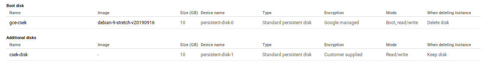

# Mounting CSEK protected disk with LUKS encryption on Google Compute Engine

Simple procedure that attaches a GCE persistent disk to a VM where the disk itself is encrypted by a key _you_ define ([Customer Supplied Encryption Key](https://cloud.google.com/compute/docs/disks/customer-supplied-encryption)).  In addition, the startup script also does a final round of encryption on top of that on the mounted disk using [LUKS](https://guardianproject.info/archive/luks/).

Essentially, you're left with a disk that can only get decrypted if you have both encryption keys:

For example, the Disk is encrypted with CSEK:
```
$ gcloud compute disks describe csek-disk --zone us-central1-a
diskEncryptionKey:
  sha256: Duz078vq5d+EIic+kfeC4BsRziDe4ulP3w4aeiRkMvM=
id: '3412210802859031969'
kind: compute#disk
name: csek-disk
```

and a mounted volume thats also further encrypted using LUKS:
```
$ lsblk -f
NAME                     FSTYPE      LABEL UUID                                 MOUNTPOINT
sda                                                                             
└─sda1                   ext4              384f1f4a-cc72-404c-91e4-9cd3ce2bf2c0 /
sdb                      crypto_LUKS       c5b39010-de81-4cc2-aec4-4ca20e8ab915 
└─vault_encrypted_volume ext4              5fb89e88-7a85-4f33-8a39-f52e048e416d /media/vaultfs
```


Both encryption keys can be stored anywhere but at a minimum, the LUKS key needs to be accessible from within the VM.

The full flow outlined here:

1. Generate LUKS and CSEK keys
2. Upload keys to [Google Secret Manager](https://cloud.google.com/secret-manager/docs/)
3. Create Disk with CESK enabled
4. Create GCE Service Account the VM will run as
5. Set IAM permissions:
   - Grant GCE Service account access to both LUKS and CESK secrets
   - Grant GCE Service account access to attach the CSEK enabled disk
6. Create the GCE instance and enable a startup script:
   - Download both secrets from `Google Secret Manager`
   - Attach the CSEK enabled disk to the VM using the secret
   - Add LUKS encryption to the mounted disk using the secret
7. As the instance is getting created,
   - Grant GCE Service account access to bind itself to the GCE instance

The procedure here runs a startup script which attaches the CSEK disk and mounts a LUKS volume. Its not necessary to 'self-mount' the disk itself but it is necessary to do the luks decryption on the VM itself. 


Also See other variations to mount persistent Disk with LUKS encryption:

* [LUKS on COS with](https://gist.github.com/salrashid123/008371c75e303727214c1012939a0ace)
* [LUKS on COS with Loopback](https://gist.github.com/salrashid123/c9a8e59b86e41329dd8f2052a38915f5)

### Setup

- Set environment variables and enable Secrets Manager

```
export PROJECT_ID=`gcloud config get-value core/project`
export PROJECT_NUMBER=`gcloud projects describe $PROJECT_ID --format="value(projectNumber)"`
export ZONE=us-central1-a

gcloud services enable secretmanager.googleapis.com
```

- Create csek and luks secrets

```
export csek_key=`openssl rand 16 | xxd -p`
export luks_key=`openssl rand 16 | xxd -p`

echo -n $csek_key |  gcloud beta secrets create csek --replication-policy=automatic --data-file=-
echo -n $luks_key |  gcloud beta secrets create luks --replication-policy=automatic --data-file=-
gcloud beta secrets versions access 1 --secret csek
gcloud beta secrets versions access 1 --secret luks
```

- Create CSEK enabled disk:

```bash
sec=`gcloud beta secrets versions access 1 --secret csek`
cat <<EOF > csek-key-file.json
    [
    {
    "uri": "https://www.googleapis.com/compute/v1/projects/$PROJECT_ID/zones/us-central1-a/disks/csek-disk",
    "key": "`echo -n $sec | base64`",
    "key-type": "raw"
    }
    ]
EOF
```

```
gcloud compute disks create csek-disk --csek-key-file csek-key-file.json --size 10GB --zone us-central1-a
```

- Create the GCE service Account

```
gcloud iam service-accounts create gce-svc-account --display-name "GCE Service Account"
gcloud iam service-accounts describe  gce-svc-account@$PROJECT_ID.iam.gserviceaccount.com

export GCE_SERVICE_ACCOUNT=gce-svc-account@$PROJECT_ID.iam.gserviceaccount.com
```

- Set IAM permission on the service account

```
gcloud compute disks  add-iam-policy-binding csek-disk  --zone us-central1-a --member=serviceAccount:$GCE_SERVICE_ACCOUNT --role=roles/compute.instanceAdmin  -q

gcloud iam service-accounts add-iam-policy-binding $GCE_SERVICE_ACCOUNT --member=serviceAccount:$GCE_SERVICE_ACCOUNT --role=roles/iam.serviceAccountUser

gcloud beta secrets add-iam-policy-binding csek --member=serviceAccount:$GCE_SERVICE_ACCOUNT --role=roles/secretmanager.secretAccessor -q
gcloud beta secrets add-iam-policy-binding luks --member=serviceAccount:$GCE_SERVICE_ACCOUNT --role=roles/secretmanager.secretAccessor -q
```

   (optional) Add logging IAM role:
   On the GCP Cloud console, assign the `Logging Writer` IAM role to: `gce-svc-account@$PROJECT.iam.gserviceaccount.com`

- Create the GCE instance

```
gcloud compute instances create gce-csek --service-account=$GCE_SERVICE_ACCOUNT --scopes=cloud-platform  --metadata enable-oslogin=FALSE,enable-oslogin-2fa=FALSE --metadata-from-file startup-script=startup.sh --image=debian-9-stretch-v20191121 --image-project=debian-cloud 

gcloud compute instances add-iam-policy-binding gce-csek --member=serviceAccount:$GCE_SERVICE_ACCOUNT --role=roles/compute.instanceAdmin
```

The final step sets permissions on the VM to complete attaching the disk.

Note: The last step has a potential race condition since we need to provision a GCE instance to allow the service account to perform operations on it "by itself" (i.,e the service account is itself attaching the encrypted disk).  The startup script attaches the disk which means the permission should propagate by then.  You don't ofcourse have to mount the CSEK disk inline on startup and are free to do omit that step.

---

- Cleanup:

```bash
umount /media/vaultfs
cryptsetup luksClose vault_encrypted_volume
gcloud compute instances detach-disk shielded-2 --disk vault-backend 

gcloud compute instances delete gce-csek -q
gcloud compute disks delete csek-disk -q
gcloud alpha secrets delete luks -q
gcloud alpha secrets delete csek -q
```

## Using alternative key distribution mechanisms instead of "gcloud secrets"

The example above used `gcloud secrets` engine as convenience but you are ofcourse free to distribute the encryption keys in anyway you see necessary. For example, the `csek` and `luks` keys can be manged via:

* [HashiCorp Vault K/V Engine](https://www.vaultproject.io/docs/secrets/kv/index.html)
  * VM will authenticate to Vault and Vault returns both keys
* [Google Cloud KMS](https://cloud.google.com/kms/docs/encrypt-decrypt)
  * Encrypt and Decrypt the keys with KMS.
* `Trusted Platform Module` in various ways:
  * a. Embed a GCP ServiceAccount to a TPM and then with KMS via [TPMTokenSource](https://github.com/salrashid123/oauth2#usage-tpmtokensource)
  * b. Encrypt the secret with the TPM's [ekPub and securely import](https://github.com/salrashid123/tpm2/tree/master/ek_import_blob) or [duplicate](https://github.com/tpm2-software/tpm2-tools/wiki/Duplicating-Objects)
  * c. Embed the keys directly to the TPM and apply IMA policies on its access.   Use the TPM to [decrypt the secret](https://github.com/salrashid123/tpm2/tree/master/seal_to_tpm)
  * d. Embed mTLS certificate to the TPM and use that to authenticate to `Vault`


The core issue in each is bootstrapping:  how do you seed the VM to allow access to the keys used for LUKS and CSEK mounted disks.  For Vault, the VM will need to authenticate to Vault to ge the keys.  For KMS, the VM will need to authenticate and get authorized to access the KMS keys.  For TPM, the VM will need to get seeded with the secret or securely transferred.

Ultimately, there are various ways to go about this depending on the complexity involved.
